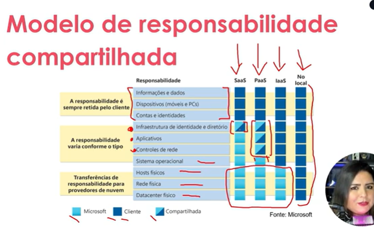

### **Computação em Nuvem Azure** 
Plataforma de serviços em nuvem da Microsoft que oferece infraestrutura (IaaS), plataforma (PaaS) e software (SaaS) como serviço. Inclui soluções como máquinas virtuais, armazenamento, IA e ferramentas de desenvolvimento, com destaque para integração e escalabilidade.

**Domínio de Objeto**: Conceito da programação orientada a objetos que representa um contexto específico de negócio, com entidades, regras e relacionamentos. Na nuvem, pode se referir à organização lógica de recursos e serviços.

**Modelos de Nuvem**:
   - **Pública**: Recursos compartilhados e gerenciados por provedores (ex.: Azure, AWS). Escalável e pago conforme o uso.
   - **Privada**: Infraestrutura dedicada a uma única organização, local ou hospedada. Maior controle e segurança.
   - **Híbrida**: Combina nuvem pública e privada, permitindo integração e flexibilidade para cargas de trabalho variáveis.

**CAPEX vs OPEX**:
   - **CAPEX (Capital Expenditure)**: Investimento inicial em ativos físicos (ex.: servidores locais).
   - **OPEX (Operational Expenditure)**: Custos operacionais contínuos (ex.: assinaturas de serviços em nuvem). A nuvem reduz CAPEX, priorizando OPEX com pagamento sob demanda e escalabilidade.

**Laboratório**: Alguns recursos são limitados para contas gratuitas. Por questões de valor ou questões de Região.

	- Aba categorias possui os serviços disponíveis no Azure. 
	- Alguns serviços que estão començando a ser disponibilizados ficam com uma label de versão prévia. Esses serviços não possuem SLA, ou garantia de que o que foi feito fique salvo. 

## **Benefícios da Nuvem**: 

### **Alta Disponibilidade**
A Azure garante **alta disponibilidade** por meio de **SLAs (Service Level Agreements)** robustos, que prometem um tempo de atividade (uptime) extremamente alto, geralmente acima de 99,9%. Isso é alcançado através de:
- **Redundância de dados**: Os dados são replicados em várias regiões geográficas.
- **Load balancing**: Distribuição de carga entre servidores para evitar sobrecarga.
- **Failover automático**: Se um servidor ou região falhar, o serviço é automaticamente redirecionado para outro disponível.

### **Escalabilidade**
A Azure permite **escalabilidade**, ou seja, a capacidade de ajustar os recursos de acordo com a demanda. Isso é especialmente útil para empresas que enfrentam flutuações no uso de recursos. Por exemplo:
- **Escalabilidade vertical**: Aumentar o poder de processamento, memória ou armazenamento de uma máquina virtual.
- **Escalabilidade horizontal**: Adicionar mais instâncias de servidores ou serviços para distribuir a carga.

### **Elasticidade**
A **elasticidade** é a capacidade de aumentar ou diminuir recursos automaticamente, em tempo real, conforme a demanda. Isso é diferente da escalabilidade, pois a elasticidade é dinâmica e automatizada. Por exemplo:
- Durante um pico de tráfego, a Azure pode adicionar mais servidores automaticamente.
- Quando a demanda diminui, os recursos extras são liberados, evitando custos desnecessários.

### **Confiabilidade**
A Azure é projetada com **infraestrutura descentralizada**, o que significa que os serviços são distribuídos em várias regiões e zonas de disponibilidade. Isso garante:
- **Tolerância a falhas**: Se um componente falhar, outros assumem o controle sem interromper o serviço.
- **Resiliência**: Capacidade de recuperação rápida após falhas.

### **Previsibilidade**
A Azure oferece **previsibilidade** em termos de desempenho e custos. Isso é alcançado através de:
- **Modelos de custo claros**: Você sabe exatamente quanto será gasto com base no uso.
- **Desempenho consistente**: Os recursos são garantidos para funcionar conforme o esperado, sem surpresas.

### **Segurança**
A Azure fornece **ferramentas avançadas de segurança**, mas a implementação dessas ferramentas é responsabilidade do cliente. Algumas funcionalidades incluem:
- **Criptografia de dados**: Tanto em repouso quanto em trânsito.
- **Firewalls e redes virtuais**: Para proteger o acesso aos recursos.
- **Gerenciamento de identidade e acesso (IAM)**: Controle quem pode acessar quais recursos.
- **Conformidade**: Certificações de segurança para atender a padrões internacionais.

### **Governança**
A **governança** na Azure é facilitada pela **automatização de recursos**. Isso inclui:
- **Políticas de controle**: Definir regras para como os recursos devem ser configurados e usados.
- **Auditoria e monitoramento**: Acompanhar o uso de recursos e garantir conformidade com as políticas.
- **Automatização de tarefas**: Reduzir a necessidade de intervenção manual.

### **Gerenciabilidade**
A Azure oferece dois tipos principais de gerenciamento:
**Escalonamento automático**:
   - Ajuste automático de recursos com base na demanda.
   - Exemplo: Adicionar mais servidores durante um pico de tráfego e reduzi-los quando a demanda cair.
**Implantação de recursos pré-configurados**:
   - Usar modelos pré-configurados (como ARM Templates) para implantar recursos rapidamente, sem necessidade de configuração manual.
   - Isso acelera o processo de implantação e reduz erros humanos.

## **Tipos de serviços de nuvem**:

### **IaaS (Infrastructure as a Service)**  
- **O que é**: Fornece infraestrutura básica (servidores, armazenamento, redes) como um serviço.  
- **Controle**: Você gerencia o sistema operacional, aplicativos e dados.  
- **Exemplo**: AWS EC2, Azure Virtual Machines.  

### **PaaS (Platform as a Service)**  
- **O que é**: Oferece uma plataforma para desenvolver, testar e gerenciar aplicações.  
- **Controle**: Você gerencia apenas os aplicativos e dados; a infraestrutura e o sistema operacional são gerenciados pelo provedor.  
- **Exemplo**: Google App Engine, Heroku.  

### **SaaS (Software as a Service)**  
- **O que é**: Software pronto para uso, acessado via navegador ou API.  
- **Controle**: Você só usa o software; tudo (infraestrutura, sistema operacional, aplicação) é gerenciado pelo provedor.  
- **Exemplo**: Google Workspace, Microsoft 365, Salesforce.  

**Resumo**:
- **IaaS**: Controle total sobre a infraestrutura.  
- **PaaS**: Foco no desenvolvimento de aplicações.  
- **SaaS**: Software pronto, sem preocupação com infraestrutura.  

Cada um atende a diferentes necessidades, desde infraestrutura personalizada (IaaS) até soluções completas e prontas (SaaS). 🚀

